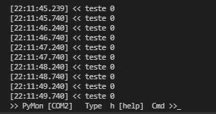

# Pymon

**The Python  Serial Monitor, in it's true form.**

Specially designed for command-line :heart:.



> This software has been mostly tested on **Windows** .
> 
> It sould work on **Linux** too, but further tests for bugfixes needed.

## Features

* Auto find and open port when connected;

* Input mode (press `i`): Input data like any microcontroller serial port;

* Show/hide timestamp;

* Decode mode: `decimal`, `hex`, `utf-8`, `unicode`;

* Serial font: change the look of printed system characters.

* :test_tube: `experimental` No latency mode: unlike normal python serial monitors, this feature will render the text with seamless latency.

* (Windows) By default the `COM 0` is in the blacklist. 

* List all available ports (`pymon -l` or `pymon --list`)

## Install

Clone the repo to your local machine:

```bash
git clone https://github.com/yxuo/Pymon.git
```

## Requirements `v0.7`

* Python 3
  
  * pyserial
  
  * 

```bash
pip install pyserial
pip install pyserial
```

Available in [requirements.txt](requirements.txt)

This script is tested on **Linux** and on **Windows** .
In general it works.

## Launch

Go to the directory where this files are located.
You can start the serial monitor with:

```bash
python -u pymon.py
```

Or using the whole file path:

```
 python -u "c:\Users\...\PyMon\pymon.py"
```

> Always use `python` with the flag `-u`, otherwise PyMon will not
